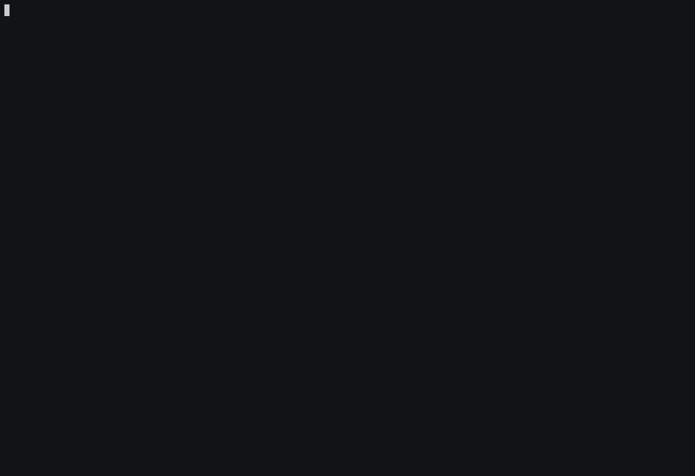

# Brain Games (Hexlet Study Project)
[Read more about this project on Hexlet](https://ru.hexlet.io/professions/backend/projects/44)

[](https://codeclimate.com/github/kirill-chertkov/backend-project-lvl1/maintainability)
[](https://codeclimate.com/github/kirill-chertkov/backend-project-lvl1/test_coverage)
[](https://travis-ci.org/kirill-chertkov/backend-project-lvl1)

## Installation
```
npm install -g be-project-lvl1-chertkov
```
[](https://asciinema.org/a/evwhz2xu8y5EONufn8GIkssZJ)
## Even Game Demo
### Successful Game
[](https://asciinema.org/a/eRHWS9fIMLaJ7OIKHKKk7BHGw)
### Failed Game
[](https://asciinema.org/a/NPkh5hhgYdbXohQJXYTifGJsH)
## Calc Game Demo
[](https://asciinema.org/a/ygiNqkCbaGPZOBkCOVyHfiTN8)
## GCD Game Demo
[](https://asciinema.org/a/X04Ax7tMTJ5YcjGYAnxIGm1iK)
## Progression Game Demo
[](https://asciinema.org/a/jyXIxlzvmzvDDmpNhg0ek3AVT)
## Prime Game Demo
[](https://asciinema.org/a/l28ECLNxEOSQlK9iRHPV81u57)
