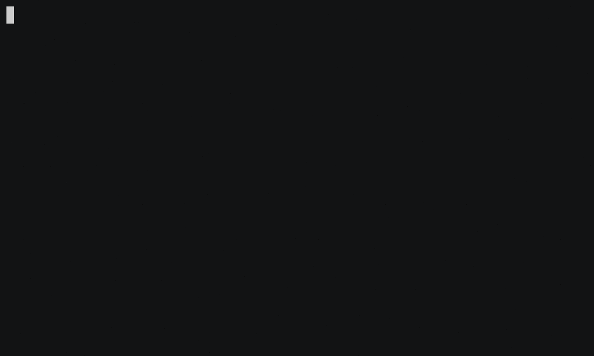

[](https://codeclimate.com/github/kirill-chertkov/backend-project-lvl1/maintainability)

[](https://codeclimate.com/github/kirill-chertkov/backend-project-lvl1/test_coverage)

[](https://travis-ci.org/kirill-chertkov/backend-project-lvl1)

## Installation
```
npm uninstall -g be-project-lvl1-chertkov@0.0.1
```
]

# Demo
## Successful Game
]
## Failed Game
]
